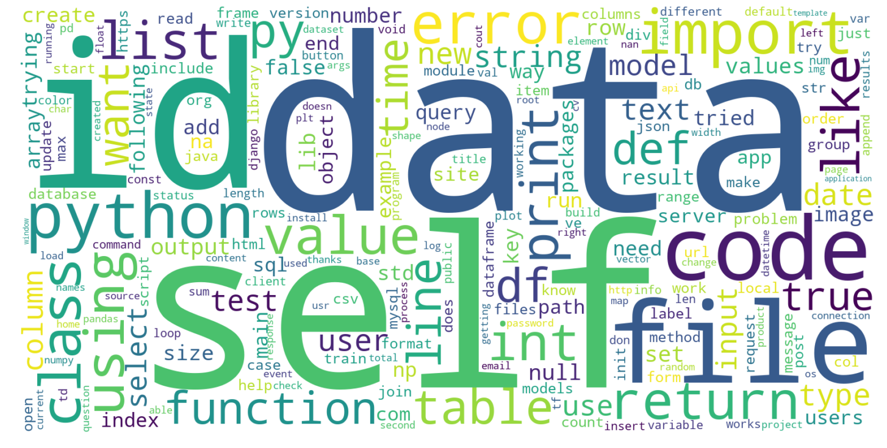

# Stack Overflow Predictive Modeling

By: Vanessa Alvarado

   

## Table of Contents
1. [Background](https://github.com/VPNA09/Stackoverflow-NLP/blob/master/readme.md#background)
2. [Problem Statement](https://github.com/VPNA09/Stackoverflow-NLP/blob/master/readme.md#problem-statement)
3. [Executive Summary](https://github.com/VPNA09/Stackoverflow-NLP/blob/master/readme.md#executive-summary)
	- [Data Acquisition](https://github.com/VPNA09/Stackoverflow-NLP/blob/master/readme.md#data-acquisition)
	- [Data Cleaning](https://github.com/VPNA09/Stackoverflow-NLP/blob/master/readme.md#data-cleaning) 
	- [Exploratory Data Analysis](https://github.com/VPNA09/Stackoverflow-NLP/blob/master/readme.md#exploratory-data-analysis)
	- [Modeling](https://github.com/VPNA09/Stackoverflow-NLP/blob/master/readme.md#modeling)
4. [Data](https://github.com/VPNA09/Stackoverflow-NLP/blob/master/readme.md#data) 
	- [Notebooks](https://github.com/VPNA09/Stackoverflow-NLP/blob/master/readme.md#notebooks)
	- [Data Dictionary](https://github.com/VPNA09/Stackoverflow-NLP/blob/master/readme.md#data-dictionary)
	- [Data Files](https://github.com/VPNA09/Stackoverflow-NLP/blob/master/readme.md#data-files)
	- [Presentation](https://github.com/VPNA09/Stackoverflow-NLP#presentation)
5. [Conclusions & Future Work](https://github.com/VPNA09/Stackoverflow-NLP/blob/master/readme.md#conclusions-and-future-work) 

## Background 
- Summarize Stack Overflow:
	- "Stack Overflow is the largest, most trusted online community for developers to learn, share​ ​their programming ​knowledge, and build their careers."
	- "Stack Overflow is a question and answer site for professional and enthusiast programmers." 
	- "Stack Overflow is an open community for anyone that codes. We help you get answers to your toughest coding questions, share knowledge with your coworkers in private, and find your next dream job."
	- "Stack Exchange (Stack Overflows parent company) is a network of question-and-answer (Q&A) websites on topics in diverse fields, each site covering a specific topic, where questions, answers, and users are subject to a reputation award process. The reputation system allows the sites to be self-moderating.[7] As of August 2019, the three most actively-viewed sites in the network are Stack Overflow, Super User, and Ask Ubuntu.[8] " -- Wikipedia
- Summarize NLP ? 

## Problem Statement
Programmers from all levels scour the web for answers for common to more challenging tasks. More times than not, Google directs you to a Stack Overflow [forum](https://stackoverflow.com/questions/53645882/pandas-merging-101): 

   

<!---
	COMMENT THIS OUT TO SEE IF IT LOOKS BETTER WITH OUT THIS ADDITIONAL IMAGE

   

--->

It's a fairly easy process to ask question on Stack Overflow. As I browsed through the website I noticed that not all posts had tags associated with them. There is no mandatory requirement to tag your question. To increase your odds of getting an answer to your coding dilema, it would be in your best interest to add any and all relevent tags. If Stack Overflow implemented a tagging suggestions system based on your question for easy access answered questions quota I will use Natural Language Processing(NLP) to create a predictve coding language tagging model. 

- Stackoverflow always suggests that you search their website before asking a new question, see if your question has already been answered. If you aren't able to find the answer you need, you can go ahead and ask a question. When you ask a question on Stackoverflow, once you start writing your titile you are given a "similar questions" suggestion box. to help guide you to the answer to your question or something similar.  

## Executive Summary

### Data Acquisition
- Where did you get your data? / How did you acquire your data?
- what did I actually end up with 
	- Missing approximately 52 days of data because of the query inputs I used. I don't believe those 52 days will make or break my project, but will go back and get the missing information and use for future iterations of my project. (DO I WANT TO ADD THIS TO MY README? PROBABLY NOT A GOOD IDEA, JSUT NEED TO FIGURE OUT WHAT I DID WRONG WITH MY QUERY AND GO BACK AND FIX IT)

Stack Overflows parent company, [Stack Exchange](https://stackexchange.com/) releases "data dumps" of all its publically available content around every 3 months via [archive.org](https://archive.org/details/stackexchange). The data is an anonymized dump of all user-contributed content on the Stack Exchange network. Stack Overflow has several XML files zipped and split up into the following categories: 

- Badges
- Comments
- PostHistory 
- PostLinks
- Posts
- Tags
- Users
- Votes 

The items of interest were: PostHistory and Posts with 25.7GB and 14.6GB zipped files   

Stackoverflow Query 

### Data Cleaning

Thanfully there wasn't much cleaning that needed to be done to my data since I was the one to query the data. I picked, what I felt would be the most useful information for my project in addtion to columns that could be interesting to use for any future work. 

To streamline the process of combining 52 weeks of data I created a function to do the work. The output was a csv file with over 1.8 million rows of data. 

Next step was to clean this .csv file to only include my "target" languages: SQL, Scala, R, Julia, C++ and Python. Taking out unnecesary languages brought my row count down to approximately 460,000. That was about a 75% loss of data. I wasn't too concerned about such a large loss of data since having over 400,000 rows would still be enough for the different modeling techniques I wanted to use. 

I noticed there were a fair amount of tags that had overlapping languages. For example, there were questions that had both the R and Python tags or SQL and Python. For this first iteration of my project I decided not to drop those rows. Some of the overlapping was within languages while others crossed languages, which makes sense because some coders will use SQL and Python together. I decided to take the first tag in the list of tags and use that to classify the question. This is something I can look into fixing for future work on this project.    

Since I am going to use NLP for modeling I knew I was going to need to clean the "body" of the data. I created a function that used BeautifulSoup to remove the majority of HTML tag artifacts. Then it removed any non-letter characters and lowercased the remaining letters. Now my data was ready for EDA.  

### Exploratory Data Analysis (EDA)

Once I was able to create a numeric classification column to indicate how I wanted to classify each question I was ready to explore the data and see what other insights I could find. 

I found that the average length of a question was about 200 words. That would be my "body_clean" columns, so that was with out any html tags, numbers, or extra miscellaneous characters. The standard deviation was pretty high, about 200. I did notice that 75% of the questions were under 238 words, which means that the majority of the data shows that most questions were under 238 words. 

Next I decided to look into the most used words for the entire corpus, then look at each individual langugaes most used words. Top 5 words used were: data, self, id, file, and code. For each langaguge their top words used also seemed to make sense. For instance, some top words for Python were: import, print, list and return. 

I then was interested in looking at bigrams. I wanted to see which words were used together the most. The bigrams didn't really offer great insights into the data as I would have liked. It showed me that maybe for future work I can consider doing more cleaning on the corpus to get rid of words that repeat themselves like: na na, nan nan and df df. The SQL bigrams did show that words like: sql server, inner join  and create table would make sense to be used alot for SQL questions.   

### Modeling

My metrics for scoring my models are based on R^2 accuracys. My 
- What are your metrics?
	- Accuracy FN and FP are weighted evenly so you might not want 
	- if baseline is really high, inbalanced classes. So you might not use accuracy 
- How did you optimize hyperparameters?
- How did you select your model?

## Data 

   

### Notebooks
1. [01 Combine Weekly .csv's](https://github.com/VPNA09/Stackoverflow-NLP/blob/master/code/01%20combine_weekly2019.ipynb) 
2. [02 Preprocessing and Cleaning](https://github.com/VPNA09/Stackoverflow-NLP/blob/master/code/02%20preprocessing_cleaning%20.ipynb)
3. [03 EDA](https://github.com/VPNA09/Stackoverflow-NLP/blob/master/code/03%20eda.ipynb)
4. [04 Modeling](https://github.com/VPNA09/Stackoverflow-NLP/blob/master/code/04%20modeling.ipynb)

### Data Dictionary
|Feature|Type|Description|
|---|---|---|
|id|int|Unique numeric identifier for Stack Overflow question |
|CreationDate|datetime|Creation date for Stack Overflow question|
|Title|object|User generated title for Stack Overflow question|
|Body|object|Original question: including html artifacts, numbers etc.|
|Tags|object|Given tags for questions|
|ViewCount|int|Number of views|
|AnswerCount|int|Number of confirmed answers|
|CommentCount|int|Number of comments|  
|target_tags|object|Created this column to find intersection between target sets and listed tags. Used this column to drop rows that didn't have any tags of interest.|
|overlap_tags|object|Created this column to check and see which languages are possibly overlapping with other langagues and iteself. Ex: SQL and Python or Python and Python-3.x|
|target_class|int|Created this column for my target classes that will be used for modeling|
|body_clean|object|Cleaned up version of the body for modeling|  
|body_length|int|Question word count| 

### Data Files
Data files are too large upload to GitHub. The following links are zipped data files: 
- 2019 Weekly csv files (zipped)
    - [Weeks 1 - 20](https://drive.google.com/open?id=1uttbh17hfhnfMLqnajbw3yX7LC27yQFY)
    - [Weeks 21-40](https://drive.google.com/open?id=1Isrpl4XX-Sv3CDmI2eNI26fX8Hu98mt4)
    - [Weeks 41-52](https://drive.google.com/open?id=15FEnPmx_LaP9_xpxB3zz6BMqFDgTbVc6)
 - [2019 Combined Weekly csv file (zipped)](https://drive.google.com/open?id=1OPgd2J14mfQkCpvhz9O8qFbql0FUpDaf)
 - [Final Version, used for modeling (zipped)](https://drive.google.com/open?id=1wvTYhFZFdC8sFVLdlCLmyiyWhG42aI_t) 

### Presentation

[Slides](https://docs.google.com/presentation/d/1sM4dFCUC8c6uHMRMuLTOqkMOfSPV2sF6Grvu7DE_70k/edit?usp=sharing)

## Conclusions and Future Work 

### Conclusions 
- What were your findings?
- What risks/limitations/assumptions affect these findings?
	- Limitations: 
		- 
- Summarize your statistical analysis, including:
	- implementation
	- evaluation
	- inference *** python language 

   
  <b>Percent Weekly Questions for Target Languges</b>

### Future Work
- How can I build off what I have? 
	- Cloud commuting
	- Different NLP techniques 
- Other data aquisition techniques 
- to better answer this question, 
