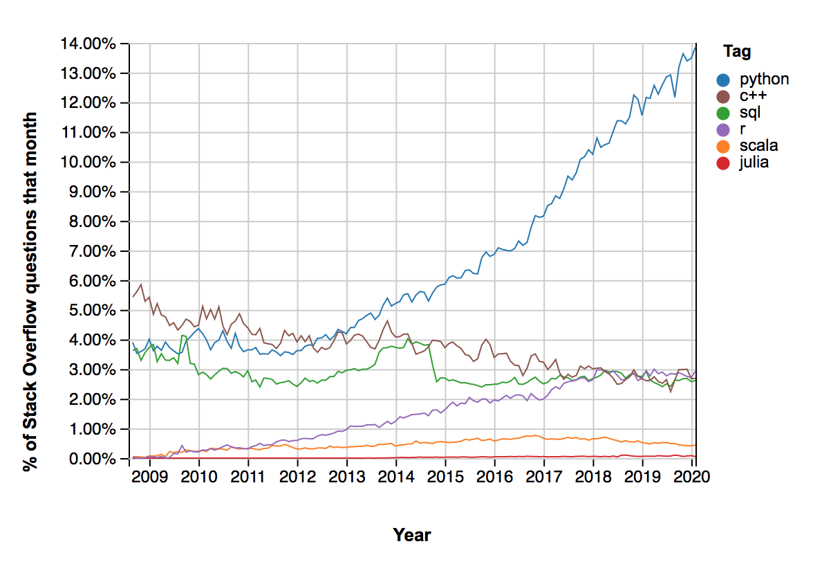

# Stack Overflow Predictive Modeling

By: Vanessa Alvarado

## Table of Contents
I. [Background](https://github.com/VPNA09/Stackoverflow-NLP/blob/master/readme.md#background)
II. [Problem Statement](https://github.com/VPNA09/Stackoverflow-NLP/blob/master/readme.md#problem-statement)
III. [Executive Summary](https://github.com/VPNA09/Stackoverflow-NLP/blob/master/readme.md#executive-summary)
	- [Data Acquisition](https://github.com/VPNA09/Stackoverflow-NLP/blob/master/readme.md#data-acquisition)
	- [Data Cleaning](https://github.com/VPNA09/Stackoverflow-NLP/blob/master/readme.md#data-cleaning) 
	- [Feature Engineering](https://github.com/VPNA09/Stackoverflow-NLP/blob/master/readme.md#feature-engineering)  
	- [Exploratory Data Analysis](https://github.com/VPNA09/Stackoverflow-NLP/blob/master/readme.md#exploratory-data-analysis)
	- [Modeling](https://github.com/VPNA09/Stackoverflow-NLP/blob/master/readme.md#modeling)
4. [Data](https://github.com/VPNA09/Stackoverflow-NLP/blob/master/readme.md#data) 
	- [Notebooks](https://github.com/VPNA09/Stackoverflow-NLP/blob/master/readme.md#notebooks)
	- [Data Dictionary](https://github.com/VPNA09/Stackoverflow-NLP/blob/master/readme.md#data-dictionary)
	- [Data Files](https://github.com/VPNA09/Stackoverflow-NLP/blob/master/readme.md#data-files)
5. [Conclusions & Future Work](https://github.com/VPNA09/Stackoverflow-NLP/blob/master/readme.md#conclusions-and-future-work) 

   

## Background 
- Summarize Stack Overflow:
	- "Stack Overflow is the largest, most trusted online community for developers to learn, share​ ​their programming ​knowledge, and build their careers."
	- "Stack Overflow is a question and answer site for professional and enthusiast programmers." 
	- "Stack Overflow is an open community for anyone that codes. We help you get answers to your toughest coding questions, share knowledge with your coworkers in private, and find your next dream job."
	- "Stack Exchange (Stack Overflows parent company) is a network of question-and-answer (Q&A) websites on topics in diverse fields, each site covering a specific topic, where questions, answers, and users are subject to a reputation award process. The reputation system allows the sites to be self-moderating.[7] As of August 2019, the three most actively-viewed sites in the network are Stack Overflow, Super User, and Ask Ubuntu.[8] " -- Wikipedia
- Summarize NLP ? 

## Problem Statement
Programmers from all levels scour the web for the best answers for common to more challenging tasks. More times than not, Google directs you to a Stack Overflow [forum](https://stackoverflow.com/questions/53645882/pandas-merging-101): 

   

   

It's a fairly easy process to ask question on Stack Overflow. As I browsed through the website I noticed that not all posts had tags associated with them. There is no mandatory requirement to tag your question. To increase your odds of getting an answer to your coding dilema, it would be in your best interest to add any and all relevent tags. To increase Stack Overflows answered questions quota I will use Natural Language Processing(NLP) to create a predictve coding language tagging model. 

## Executive Summary

### Data Acquisition
- Where did you get your data? / How did you acquire your data? (what did I actually end up with)

Stack Overflows parent company, [Stack Exchange](https://stackexchange.com/) releases "data dumps" of all its publically available content around every 3 months via [archive.org](https://archive.org/details/stackexchange). The data is an anonymized dump of all user-contributed content on the Stack Exchange network. Stack Overflow has several XML files zipped and split up into the following categories: 
	- Badges
	- Comments
	- PostHistory 
	- PostLinks
	- Posts
	- Tags
	- Users
	- Votes 

The items of interest were: PostHistory and Posts with 25.7GB and 14.6GB zipped files   

### Data Cleaning
#### 2019 Weekly Data
- 

#### 2019 Combined Data  
- 

#### Final (For Modeling) 
- 

### Feature Engineering
- How did you transform or engineer your data? Why?

### Exploratory Data Analysis (EDA)
- 
- 

### Modeling
- What are your metrics?
	- Accuracy FN and FP are weighted evenly so you might not want 
	- if baseline is really high, inbalanced classes. So you might not use accuracy 
- How did you optimize hyperparameters?
- How did you select your model?

## Data 

### Notebooks
1. [01 Combine Weekly .csv's](https://github.com/VPNA09/Stackoverflow-NLP/blob/master/code/01%20combine_weekly2019.ipynb) 
2. [02 Preprocessing and Cleaning](https://github.com/VPNA09/Stackoverflow-NLP/blob/master/code/02%20preprocessing_cleaning%20.ipynb)
3. [03 EDA](https://github.com/VPNA09/Stackoverflow-NLP/blob/master/code/03%20eda.ipynb)
4. [04 Modeling](https://github.com/VPNA09/Stackoverflow-NLP/blob/master/code/04%20modeling.ipynb)

### Data Dictionary
|Feature|Type|Description|
|---|---|---|
|id|int|Unique numeric identifier for Stack Overflow question |
|CreationDate|datetime|Creation date for Stack Overflow question|
|Title|object|User generated title for Stack Overflow question|
|Body|object|Original question: including html artifacts, numbers etc.|
|Tags|object|Given tags for questions|
|ViewCount|int|Number of views|
|AnswerCount|int|Number of confirmed answers|
|CommentCount|int|Number of comments|  
|target_tags|object|Created this column to find intersection between target sets and listed tags. Used this column to drop rows that didn't have any tags of interest.|
|overlap_tags|object|Created this column to check and see which languages are possibly overlapping with other langagues and iteself. Ex: SQL and Python or Python and Python-3.x|
|target_class|int|Created this column for my target classes that will be used for modeling|
|body_clean|object|Cleaned up version of the body for modeling|  

### Data Files
Data files are too large upload to GitHub. The following links are zipped data files: 
- 2019 Weekly csv files (zipped)
    - [Weeks 1 - 20](https://drive.google.com/open?id=1uttbh17hfhnfMLqnajbw3yX7LC27yQFY)
    - [Weeks 21-40](https://drive.google.com/open?id=1Isrpl4XX-Sv3CDmI2eNI26fX8Hu98mt4)
    - [Weeks 41-52](https://drive.google.com/open?id=15FEnPmx_LaP9_xpxB3zz6BMqFDgTbVc6)
 - [2019 Combined Weekly csv file (zipped)](https://drive.google.com/open?id=1OPgd2J14mfQkCpvhz9O8qFbql0FUpDaf)
 - [Final Version, used for modeling (zipped)](https://drive.google.com/open?id=1wvTYhFZFdC8sFVLdlCLmyiyWhG42aI_t) 

## Conclusions and Future Work 

### Conclusions 
- What were your findings?
- What risks/limitations/assumptions affect these findings?
	- Limitations: 
		- 
- Summarize your statistical analysis, including:
	- implementation
	- evaluation
	- inference

   
  <b>Percent Weekly Questions for Target Languges</b>

### Future Work
- How can I build off what I have? 
	- Cloud commuting
	- Different NLP techniques 
- Other data aquisition techniques 
